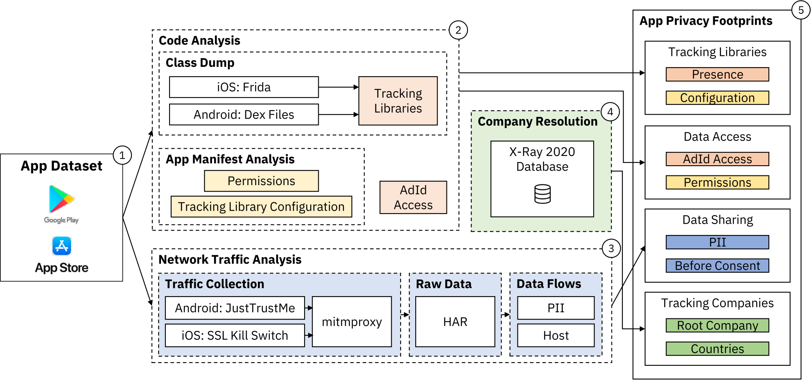

# PlatformControl

**Download and privacy analysis of iOS and Android apps at scale and over time.**

The development of PlatformControl was led by Konrad Kollnig from the Computer Science Department, University of Oxford.

## Overview

<p align="center">
  
</p>

The above figure shows a schematic overview of how this repository was used in a past research paper. For details, please see the corresponding publication: [Are iPhones Really Better for Privacy? A Comparative Study of iOS and Android Apps](https://arxiv.org/abs/2109.13722)

## Organisation

This project has multiple parts:

1. <https://github.com/TrackerControl/xray-archiver-android-ios> - To explore what iOS and Android apps are on the app stores, and also for the download of Android apps, as well as a high level analysis of iOS and Android apps (permissions, mainly).
2. <https://github.com/TrackerControl/platformcontrol-token-dispenser> - Required for the downloading of Android apps at scale.
3. <https://github.com/TrackerControl/platformcontrol-ios-downloader> - To download iOS apps at scale from the App Store.
4. <https://github.com/TrackerControl/platformcontrol-android-ios-analysis> - For the analysis of tracking libraries and contacted tracking domains, for both iOS and Android
5. <https://github.com/TrackerControl/JustTrustMe> - To disable certificate pinning in Android apps
6. <https://kollnig.net/2022/01/app-research-circumventing-permissions/> - How to grant permissions to iOS and Android apps through the command line (important for analysis of PII from network traffic). Script [here](https://gist.github.com/kasnder/3eb32449512a4dba4a92949c8d337a92).
7. <https://github.com/facundoolano/app-store-scraper#privacy> - Retrieval of privacy labels from Apple App Store. Code written and contributed by [@kasnder](https://github.com/kasnder/).

## Data Access

We've already published:
- our dataset of iOS tracker libraries: <https://github.com/TrackerControl/platformcontrol-android-ios-analysis/blob/main/data/ios_signatures.json>
- our database of tracking domains, and the networks of companies and the jurisdictions behind: <https://github.com/TrackerControl/tracker-control-android/blob/master/app/src/main/assets/xray-blacklist.json>

We're currently in the process of making more data available.

## Ready-to-use analysis with TrackerControl

As a sub project of PlatformControl, TrackerControl is an indepedent and somewhat popular Android app to privacy analysis and control. It contains some of the core analysis functionality of PlatformControl (though by far not all of it), conducting both network traffic and tracker library analysis.

<p align="center">
  
</p>

You can find TrackerControl at <https://trackercontrol.org/>.

Download directly [here](https://github.com/TrackerControl/tracker-control-android/releases/latest/download/TrackerControl-githubRelease-latest.apk), from [F-Droid](https://f-droid.org/packages/net.kollnig.missioncontrol.fdroid), or a feature-reduced version from [Google Play](https://play.google.com/store/apps/details?id=net.kollnig.missioncontrol.play).

## Citation

If you use this project as part of your academic studies, please kindly cite the below articles:

```
@article{kollnig_goodbye_2022,
  title = {Goodbye {Tracking}? {Impact} of {iOS App Tracking Transparency} and {Privacy Labels}},
  shorttitle = {Goodbye {Tracking}?},
  author = {Kollnig, Konrad and Shuba, Anastasia and Van Kleek, Max and Binns, Reuben and Shadbolt, Nigel},
  year = {2022},
  journal = {arXiv:2204.03556 [cs]},
  eprint = {2204.03556},
  eprinttype = {arxiv},
  primaryclass = {cs},
  archiveprefix = {arXiv}
}

@article{kollnig2021_iphone_android,
  author = {Konrad Kollnig and Anastasia Shuba and Reuben Binns and Max Van Kleek and Nigel Shadbolt},
  doi = {10.2478/popets-2022-0033},
  title = {Are {iPhones} Really Better for Privacy? A Comparative Study of {iOS} and {Android} Apps},
  journal = {Proceedings on Privacy Enhancing Technologies},
  number = {2},
  volume = {2022},
  year = {2022},
  pages = {6--24}
}

@article{kollnig_before_2021,
  title = {Before and after {GDPR}: Tracking in Mobile Apps},
  shorttitle = {Before and after {GDPR}},
  author = {Kollnig, Konrad and Binns, Reuben and Van Kleek, Max and Lyngs, Ulrik and Zhao, Jun and Tinsman, Claudine and Shadbolt, Nigel},
  year = {2021},
  journaltitle = {Internet Policy Review},
  volume = {10},
  number = {4},
  issn = {2197-6775},
  doi = {10.14763/2021.4.1611},
  numpages = 30
}

@inproceedings {kollnig2021_consent,
  author = {Konrad Kollnig and Reuben Binns and Pierre Dewitte and Max Van Kleek and Ge Wang and Daniel Omeiza and Helena Webb and Nigel Shadbolt},
  title = {A Fait Accompli? An Empirical Study into the Absence of Consent to Third-Party Tracking in Android Apps},
  booktitle = {Seventeenth Symposium on Usable Privacy and Security ({SOUPS} 2021)},
  year = {2021},
  isbn = {978-1-939133-25-0},
  pages = {181--196},
  url = {https://www.usenix.org/conference/soups2021/presentation/kollnig},
  publisher = {USENIX Association},
  month = aug,
}
```
